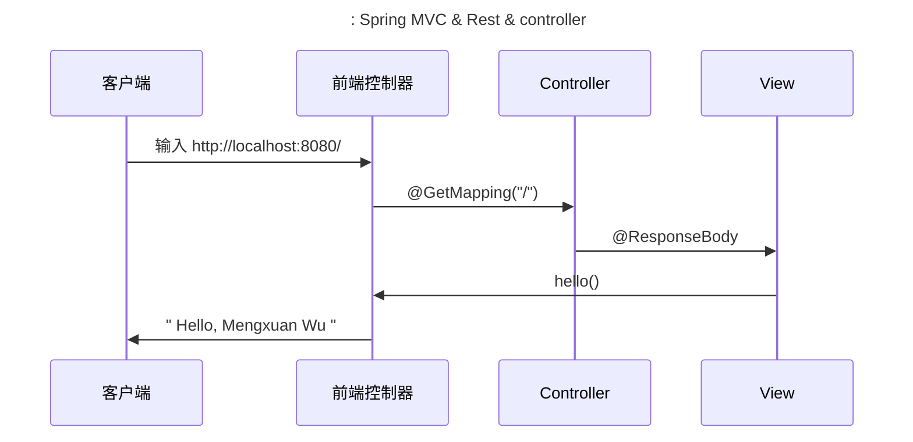

# sps 备品备件环境搭建

author：wumengxuan

## Spring Boot 基础

### Spring Boot 启动原理

`@SpringBootApplication` 是一个复合注解，标注当前配置类，继承自 `@Configuration` ，会将当前类内声明的一个或多个以 `@Bean` 注解标记的方法的实例纳入到 `srping` 容器中，并且实例名就是方法名。  

```java
@SpringBootApplication         // mainClass() 的入口
public class SpsDemoWmxApplication {

    public static void main(String[] args) {
        SpringApplication.run(SpsDemoWmxApplication.class, args);
    }

}
```

## 构建基础框架

### 新建 Spting Boot 项目

#### 选择组件包

New Project -- Spring Initializr  

可以在 https://start.spring.io/ 网站上选择组件包

#### 创建项目

Project Metadata


#### 添加依赖 ※

此步骤要根据项目的需求选择依赖，比如有些后台进程跑定时任务不需要 web 。本项目是前后端分离，不需要 web 界面，但是要处理 web 的请求的API。

主要依赖：JPA, Web, H2，DevTools, Lombok，Cache

- JPA 开发规范

- H2 数据库

- web 展示

- DevTools 热部署 （Crtl+F9），代码已改好就可以生效

- Lombok 注释型代码生成工具

- Actuator 

  

创建好项目以后可以将 `.mvn`  `mvnw`  `mvnw.cmd` 文件删掉，主要在 `/src` 文件下进行开发和测试。

#### sps-demo 目录结构

```bash
sps-demo
├── pom.xml
├── sps-demo.iml
├── sps.jdl
└── src
    ├── main
    │   ├── java
    │   │   └── cn
    │   │       └── wilmar
    │   │           └── spsdemo
    │   │               ├── domain                    //实体（Entity）
    │   │               │   ├── Organization.java
    │   │               │   ├── Role.java
    │   │               │   └── User.java
    │   │               ├── repository                          // DAO层（即仓库，数据访问层）
    │   │               │   ├── OrganizationRepository.java
    │   │               │   ├── RoleRepository.java
    │   │               │   └── UserRepository.java
    │   │               ├── service                             // 服务层，业务类代码
    │   │               │   └── UserService.java         
    │   │               ├── SpsDemoApplication.java             // main入口，作为框架配置
    │   │               └── web								 // 展示层
    │   │                   ├── OrganizationController.java
    │   │                   ├── RoleController.java
    │   │                   └── UserController.java
    │   └── resources
    │       ├── application.properties
    │       └── schema.sql
    └── test                                                    // 测试
        └── java
            └── cn
                └── wilmar
                    └── spsdemo
                        ├── repository
                        │   └── UserRepositoryTest.java
                        ├── service
                        │   └── UserServiceTest.java
                        ├── SpsDemoApplicationTests.java
                        └── web
                            └── UserControllerTest.java

19 directories, 21 files
```

#### Hello,world

创建一个最简单的 Hello,Mengxuan Wu! 验证框架是否可以跑起来：

```java
@RestController         // 声明为 MVC 里的C Restful请求，返回是个text文本
class HelloController { // 普通类
    @GetMapping("/")    // 上下文请求：可返回的管理端点
    @ResponseBody
    public String hello() {
        return "Hello, Mengxuan Wu!";
    }
}
```

访问 http://localhost:8080 出现 Hello, Mengxuan Wu! 即可。

❓什么浏览器会出现 Hello, Mengxuan Wu 这样的返回值？



参考：

#### 访问 h2-console

h2 的内存数据库，在生产环境下不开放

访问 http://localhost:8080/h2-console 


- url: jdbc:h2:mem:testdb
- username: sa
- password: 空

#### 创建 Git 仓库

项目开发的过程中注意要管理好我们代码的每一个版本，每做完一个阶段都要记得提交 git

**Alt+F12 **在项目目录下打开命令行，创建 Git 仓库：

```bash
# git global settings
git config --global user.name "rebeccawmx"
git config --global user.email "rebecca.wmx@outlook.com"

# git commit
git init
# 通过 http 进行连接
git remote set-url origin https://github.com/rebeccawmx/sps-demo-wmx.git
git add .
git commit -m "Complete Hello,world"
git push -u origin master
```

### 基础对象管理

开发对业务相关的内容，以用户管理业务（ CRUD 操作）为例子

#### 添加 POJO /域对象（领域模型层）

创建一个域对象，目的是为了创建数据库对象对实体的映射关系。根据 JPA 规范，我们需要创建一个 Entity （实体）对象

```java
import javax.persistence.Id

@Data                                        // lombok 自动生成方法 getId等
@NoArgsConstructor
@AllArgsConstructor
@Entity                                      // JPA规范
public class User {                          // 数据库对象
    
    @Id 
    @GeneratedValue(strategy = GenerationType.IDENTITY) // 组件生成策略（与数据库有关）
   
    Long id;             // 组件 javax.persistence JPA标准规范
                         //（导入包的时候一定不能导入Spring的ID）
    String username;

    String password;
}
```

设计规范：

表格--id

枚举型code，只有一个，而且不需要改

#### 添加控制器 Controller（ Web 层）

创建控制器：UserController

```java
@RestController                                  // 所有方法以 Rest 方式返回
											 // 所有返回的方法都是以 ResponseBody 返回
@RequestMapping("/api")
public class UserController {
    // private final UserRepository userRepository; // 推荐，需要写构造函数
    @Autowired UserRepository userRepository;       // 不推荐autowired，传入UserRepository的实体 
    
	//简单的查询函数
    @GetMapping("/users")                           // 访问，json对象文本
    public List<User> getAllUsers() {
        return userRepository.findAll();
    }
}
```

#### 数据访问对象 Repository（数据层）

通过接口实现对数据层的访问：创建 DAO ( *Data Access Object*  )：UserRepository

```java
//通过接口实现
public interface UserRepository
extends JpaRepository<User, Long> // 支持User对象{
}
```

访问：http://localhost:8080/users 和 h2 console。然后插入数据，访问 `/users` 会看到插入的数据


#### 初始化数据

由于 h2 是内存数据库，每次重启服务里面的数据都会消失，所以我们要采用持久化的方式创建表和数据。

初始化数据有两种方式：

- sql 脚本
- Flyway

1.  在 `/resources ` 里 new 一个脚本 `schema.sql`

   ```sql
   DROP TABLE IF EXISTS `USER`;
   
   CREATE TABLE IF NOT EXISTS `USER` (
     id       BIGINT AUTO_INCREMENT,            // 自动增长
     username VARCHAR(50) NOT NULL,
     password VARCHAR(60),                      // 为什么是 60 位？
     PRIMARY KEY (id)
   );
   
   INSERT INTO `USER` (id, username, password) VALUES (1, 'yinguowei', '111111');
   INSERT INTO `USER` (id, username, password) VALUES (2, 'chengyu', '222222');
   INSERT INTO `USER` (id, username, password) VALUES (3, 'lichenjing', '333333'); 
   ```

要注意的是，在程序启动的时候，jpa 会自动调用 sql 初始化数据，因此要在配置文件中告诉这张表的所在位置：

```properties
spring.datasource.schema=classpath:schema.sql // 指定 sql 脚本位置（启动后自动执行）
```

访问 http://localhost:8080/api/usrs/1 变换 id 可以看到用户信息

#### 其他配置 ( application.properties )

```properties
spring.datasource.url=jdbc:h2:mem:testdb;DB_CLOSE_ON_EXIT=FALSE //数据库优化
spring.datasource.username=sa // 默认
spring.datasource.password=   // 默认
spring.datasource.initialization-mode=always  // 只有嵌入式数据库才可以执行（默认），mysql 不会执行
spring.datasource.schema=classpath:schema.sql // 指定 sql 脚本位置（启动后自动执行）
spring.h2.console.enabled=true // 开启 h2 控制台
open-in-view=false 
spring.jpa.show-sql=true           // 优化
spring.jpa.hibernate.ddl-auto=none // 关掉
```

`hibernate.hbm2ddl.auto` 参数的作用主要用于：自动创建|更新|验证数据库表结构。一定要禁止该功能。 

- update（默认） ：第一次加载 hibernate 时根据 model 类会自动建立起表的结构（前提是先建立好数据库）。若发现脚本中的数据与数据库的不一致，会强制更新，造成数据库丢失。

#### 完整操作对象操作

对于我们刚开始添加的控制器只实现了简单的查询业务，完整的对象操作要将 CRUD 都实现，如何定义出参入参、上下文等等。具体实现的方法以及规范参考[《Restful API 开发规范》](http://note.youdao.com/noteshare?id=7c232bb9fe1a65dbae4ec4810f898ee8&sub=63D9F34973944C52AC41330FBE392D1C) 及相关示例 [restful-api-demo](http://git.wilmar.cn/YinGuowei/restful-api-demo) 

```java
@RestController
@RequestMapping("/api")           //业务方法放到 api 里面
public class UserResource {
    
    private final UserRepository userRepository;

    @Autowired
    public UserResource(UserRepository userRepository) {
        this.userRepository = userRepository;
    }

    @GetMapping("/")
    public List<User> getAllUsers() {
        return userRepository.findAll();
    }

    @GetMapping("/users")
    public List<User> users() {
        return userRepository.findAll();
    }

    @GetMapping("/users/{id}")
    public User getUser(@PathVariable("id") Long id) {
        return userRepository.findById(id).get();
    }

    @PostMapping("/users")
    public void save(@RequestBody User user) {
        userRepository.save(user);
    }

    @PutMapping("/users")
    public void update(@RequestBody User user) {
        userRepository.save(user);
    }

    @DeleteMapping("/users/{id}")
    public void delete(@PathVariable("id") Long id) {
        userRepository.deleteById(id);
    }
}
```

## 复杂查询

最后介绍在特别复杂的查询中，通常是多种条件或者混合条件检索，拼接 SQL、拼接翻页器等信息：

```java
// Repository
@Query("select u from User u where 1=1 and (?1 is null or u.username like concat('%',?1,'%')) and (?1 is null or u.email like concat('%',?1,'%'))")
Page<User> queryByKeyword(@Param("keyword") String keyword, Pageable pageable);

// Controller
@GetMapping("/users")
public Page<User> findUsers(@RequestParam(value = "keyword", required = false) String keyword, @PageableDefault Pageable pageable) {
    return userService.queryUsers(keyword, pageable);
}
   
// Mock Test 
@Test
public void findUsers() {
    List<User> users;
    users = userController.findUsers(null, null).getContent();
    assertEquals(3, users.size());

    users = userController.findUsers("yinguowei", null).getContent();
    assertEquals(1, users.size());

    users = userController.findUsers("jon", null).getContent();
    assertEquals(0, users.size());

    users = userController.findUsers(null, PageRequest.of(0, 1)).getContent();
    assertEquals(1, users.size());
}
```

bash 测试脚本（注意url里面带特殊字符要加上双引号）

```bash
curl "http://localhost:8080/api/users?page=0&size=1" | jq
curl "http://localhost:8080/api/users?keyword=chen&page=0&size=10" | jq
```

## 遇到的问题

- 1. git push 的时候遇到的错误：

```bash
C:\Users\wumengxuan\Desktop\我的文档\sps-demo-wmx>git push -u origin master
ssh: connect to host git.wilmar.cn port 22: Connection timed out
fatal: Could not read from remote repository.

Please make sure you have the correct access rights
and the repository exists.
```

原因：采用 ssh 建立的连接

解决方案：换用 http 进行传输

```bash
git remote set-url origin http://git.wilmar.cn/wumengxuan/sps-demon-wmx.git
git push origin master
```

- 2. 设置好实体发现：

```java
Caused by: org.hibernate.AnnotationException: No identifier specified for entity: com.example.domain.p.User
```

网上有两种解释：

1. 没有添加主键的注解 `@Entity`
2. 添加了 `@Entity` 仍然出现这样的错误。

解决方法：`import javax.persistence.Id` 而我却导入了 `org.springframework.data.annotation.Id` 

虽然 IDE 语法检测不会报错，但是我们要用到的是 `persistence.Id`。

## 附录：注解

##### `@SpringBootApplication`

- 是一个复合注解，标注当前配置类，继承自 `@Configuration` ，会将当前类内声明的一个或多个以 `@Bean` 注解标记的方法的实例纳入到 `srping` 容器中，并且实例名就是方法名。  

   